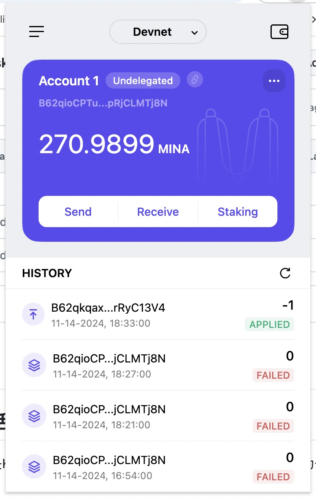

# Mina 协议技术解析

## 证明系统概述

Mina采用了Kimchi - 一种专为高性能区块链定制的zk-SNARKs实现。通过巧妙运用递归特性，Kimchi让Mina成为第一个真正实现轻量级的区块链。

### zk-SNARKs核心特性

#### 零知识性
- 证明者可向验证者证明某个命题,无需暴露任何实际数据
- 在Mina中实现了交易验证的隐私保护,只需证明有效性而非公开细节

#### 简洁性 
- 证明文件仅几百字节,验证时间毫秒级
- 是Mina实现"恒定大小区块链"的关键技术支撑

#### 非交互性
- 单次证明即可,验证者可独立完成验证
- 极大提升了网络效率,适合去中心化环境

#### 知识论证
- 证明者不仅证明命题为真,还证明掌握相关信息
- 为Mina的链上操作提供可信保障

### Kimchi特性

#### 无需可信设置
- 突破传统zk-SNARKs需要可信设置的限制
- 进一步增强了系统安全性和去中心化程度

#### 支持无限递归
- 高效处理递归证明,性能不随链增长而下降
- 是实现恒定链大小的核心技术创新

#### 优化性能
- 针对区块链场景优化的证明生成和验证
- 满足高并发环境下的性能需求

## 递归零知识证明在共识中的应用

### 状态压缩
- 通过递归证明将整条链压缩至22KB固定大小
- 每个新区块包含自身证明和历史递归证明
- 最终实现单一证明包含全链状态

### 高效验证
- 仅需验证最新递归证明
- 显著降低参与门槛,支持轻量级设备运行节点

### 隐私与完整性
- 零知识特性保护交易隐私
- 同时确保计算正确性和状态完整性

### 去中心化与扩展性
- 轻量化设计让更多用户可运行完整节点
- 网络负载不随链增长而显著提升

## Auro钱包配置记录

## 交易哈希
5Jv3PfsdaSVUUddgE7bsMtsshZJFw7NacJsU3QaxaNNxHFYPeQaW
